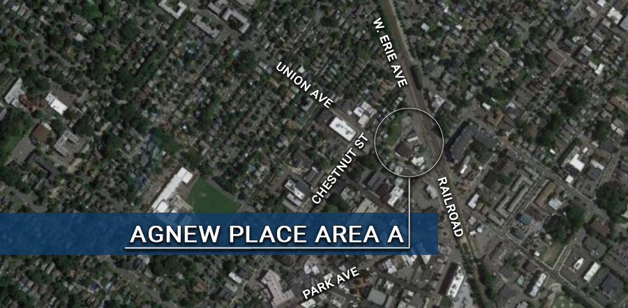

[Return to Areas of Development page](/community-development/areas-of-redevelopment/)

# Agnew Place Area A *"The Triangle"*

**Location:** Agnew Place Area A *"The Triangle"* Between West Erie and Union Avenues

**Project Type:** Residential with Retail Space

**Project Status:** 

The triangle encompassing the Borough’s former DPW site as its base and coming to a point at the nexus of Erie and Union Avenues was included in the original “redevelopment zone” and subsequently incorporated into a designated area in need of redevelopment in 2016.  The two-part redevelopment plan adopted in April of 2019 identified the triangle parcels as Agnew Area A. This original plan allowed for up to 6 stories with 140 residential units with onsite parking and accessory retail. 

**Below find documents detailing the history of Agnew Place Area A:**

[Agnew Place Area A Redevelopment Plan](https://storage.googleapis.com/static.rutherford-nj.com/community-development/agnew-a/2019-01-25%20Rutherford%20Area%20A_The%20Triangle%20Redevelopment%20Plan.pdf)

[Agnew Area In Need Study, with Planning Board Resolution](https://storage.googleapis.com/static.rutherford-nj.com/community-development/agnew-a/2.16%20Agnew%20Area%20in%20Need%20Study%20with%20Planning%20Board%20reso.pdf)

