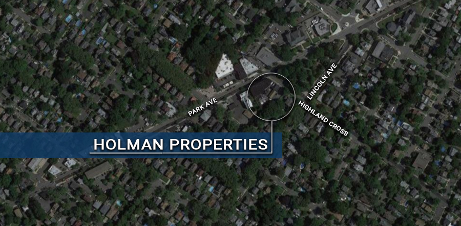

[Return to Areas of Development page](/community-development/areas-of-redevelopment/)

# Holman Properties (Block 110)

**Location:** Highland Cross, Park and Lincoln Avenues

**Project Status:** Designated Area In Need Of Redevelopment

The Holman study area straddles two zoning designations, a residential one-family ( R-1) on Lincoln Avenue and a business three-story (B-3) on Park Avenue. It is comprised of buildings which were owned by the late Mr. Holman. His heirs, realizing the majority of the properties had fallen into disrepair, reached out to the Borough requesting an area in need of redevelopment study be conducted.  The Borough agreed. The study was carried out by Neglia Engineering at the end of 2019, at the direction of the Planning Board and it was determined that the area did meet the statutory requirements. The resolution by the Planning Board recommending the study’s findings, was recently approved and sent to the Mayor and Council for their review and consideration.  

**Below find Holman Properties (Block 110) Area In Need Of Redevelopment Study:**

[Block 110 Area In Need Of Redevelopment Study](https://storage.googleapis.com/static.rutherford-nj.com/community-development/holman/Block%20110%20Holman%20Properties%20Area%20in%20need.pdf)
