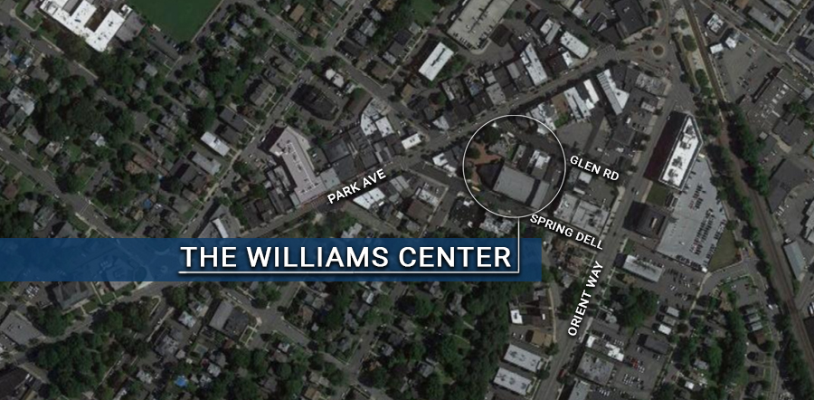

[Return to Areas of Development page](/community-development/areas-of-redevelopment/)

# The Williams Center

**Location:** 1 Williams Plaza, Park Ave between Glen Road and Spring Dell

**Project Type:** Mixed Use With Arts Component

**Project Status:** Designated Area In Need of Redevelopment

Known for years as The Rivoli, the theater was built in 1922 primarily for Vaudeville tours. It soon morphed into a feature movie house and enjoyed a special place in the heart of town and the heart of Rutherfordians for over 40 years. Fire damaged the inside of the theater in the 1970’s and community leaders worked hard to save the Rivoli transforming it into the William Center for the Performing Arts.  A complicated history played out over the next several years with the county finally assuming control of the facility in the 1990’s.  Stalwart volunteers determined to preserve an arts venue in Rutherford have devoted countless hours to providing live performance, film festivals and art exhibits. In 2016 the Mayor and Council adopted an area in need of redevelopment in part to have a say in how the facility is revitalized to ensure that an arts component is preserved within the redevelopment area. Most recently, the Council hosted a stakeholder session to seek input from interested residents in order to incorporate those ideas into a redevelopment plan.

**Below find The Williams Center Theater District Redevelopment Study:**

[Williams Center Theater District Redevelopment Study](https://storage.googleapis.com/static.rutherford-nj.com/community-development/williams-center/William%20Center_%20Theater%20District%20Redevelopment%20Study.pdf)
