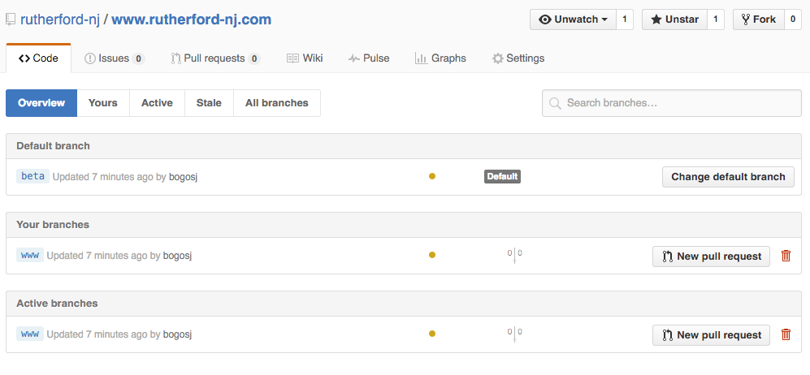
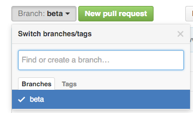
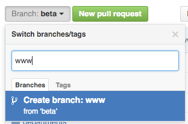

All changes happen by default on the `beta` branch. When you have confirmed that beta.rutherford-nj.com is good to "go live", follow these steps:

## (Optional) Inspect the changes that will "go live"

If you want to see all of the differences between what is currently on www and beta, you can go to the [**compare branches page**](https://github.com/rutherford-nj/www.rutherfordboronj.com/compare/www...beta).

## Step 1: Delete the www branch
Visit the [**branches**](https://github.com/rutherford-nj/www.rutherfordboronj.com/branches) page of the repository and delete the www branch by clicking one of the red trash cans on the right side of the page.  

It doesn't matter if you delete it from *Active branches* or *Your branches*, it's the same branch you're deleting. The *Your branches* section will only show up if you are the one that created the **www** branch in the first place.

## Step 2: Re-create the www branch

Navigate to the [**home page of the GitHub Repository**](https://github.com/rutherford-nj/www.rutherfordboronj.com), and click the Branch dropdown button.  

Type in **www** in the "Find or create a branch..." box, then click the option to "Create branch: www".  

Once you've done this, the [**Travis CI build**](https://travis-ci.org/rutherford-nj/www.rutherfordboronj.com/builds) should start and when complete, it will update www.rutherfordboronj.com.