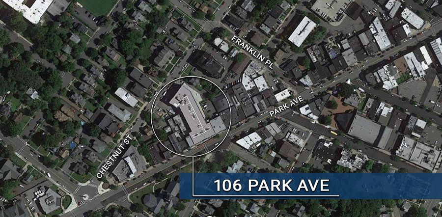

# 106 Park Ave

{: .img-fluid }

**Location:** 106 Park Ave

**Project Type:** Residential with retail space

**Project Status:** Completed

The completed Parker is a 52 unit, residential building with retail space and onsite parking.

**Below find documents detailing the history of 106 Park Ave:**

[106 Park Redevelopment Study and Preliminary Investigation Report](https://storage.googleapis.com/static.rutherford-nj.com/community-development/106%20park/106%20Park%20Redevelopment%20Study%20and%20Preliminary%20Investigation%20Report.pdf)

[106 Park/The Maples Plan for Rehabilitation Area](https://storage.googleapis.com/static.rutherford-nj.com/community-development/106%20park/106%20Park_The%20Maples_2003%20Plan%20for%20Rehabilitation%20Area.pdf)

[106 Park Ordinance](https://storage.googleapis.com/static.rutherford-nj.com/community-development/106%20park/3445-18%20-%20Redevelopment%20-%20Maples.pdf)

[106 Park Redevelopment Agreement](https://storage.googleapis.com/static.rutherford-nj.com/community-development/106%20park/RDA%20106%20Park%20Ave.%20Rutherford.pdf)

[Financial Agreement](https://storage.googleapis.com/static.rutherford-nj.com/community-development/106%20park/Parker%20Financial%20Agreement.pdf)

[Application for Tax Abatement](https://storage.googleapis.com/static.rutherford-nj.com/community-development/106%20park/Parker_%20Long%20Term%20Tax%20Exemption.pdf)

