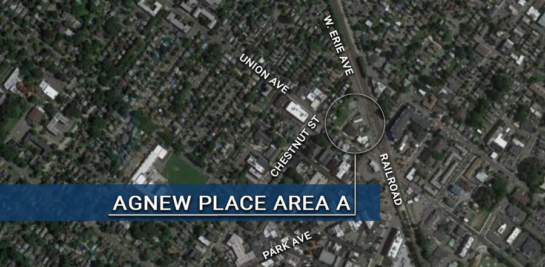

# Agnew Place Area A *"The Triangle"*

{: .img-fluid }

**Location:** Agnew Place Area A *"The Triangle"* Between West Erie and Union Avenues

**Project Description:** 

· Redevelopment plan approved- see below

· Developer’s project plan pending

**Below find documents detailing the history of Agnew Place Area A:**

[Agnew Place Area A Redevelopment Plan](https://storage.googleapis.com/static.rutherford-nj.com/community-development/agnew-a/Redevelopment%20PlanArea%20A.pdf)

[Agnew Area In Need Study, with Planning Board Resolution](https://storage.googleapis.com/static.rutherford-nj.com/community-development/agnew-a/2.16%20Agnew%20Area%20in%20Need%20Study%20with%20Planning%20Board%20reso.pdf)

[Application for Tax Abatement](https://storage.googleapis.com/static.rutherford-nj.com/community-development/agnew-a/Agnew%20Area%20A%20-%20Long%20Term%20Tax%20Exemption.pdf)

