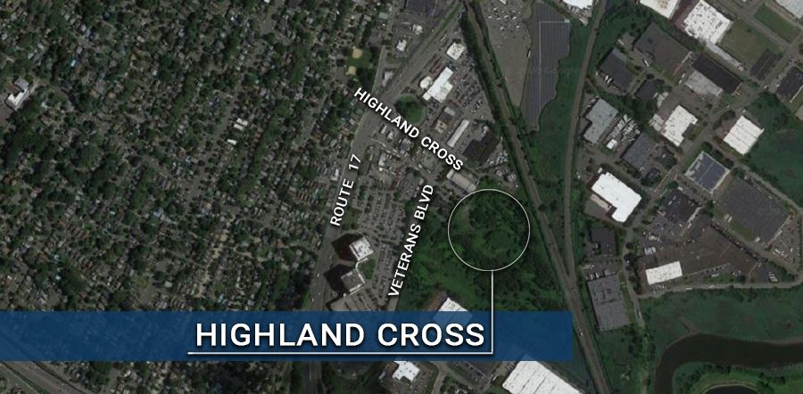

# Highland Cross Warehouse/Light Industrial Development

{: .img-fluid }

**Location:** The end of Highland Cross, east of Route 17 and located primarily within the zoning authority of the NJSEA.

**Project Description:** 

· A 357,521 square foot warehouse/light industrial facility

· 8 Loading docks

· 206 exterior & 175 interior van parking spaces

· Construction is underway

**Below find documents detailing the history of Highland Cross:**

[Highland Cross Financial Agreement](https://storage.googleapis.com/static.rutherford-nj.com/community-development/highland-cross/HC_Financial_Agreement.pdf)

[Mayor and Council Ordinance 3549-21 Financial Agreement](https://storage.googleapis.com/static.rutherford-nj.com/codes-ordinances/3549-21%20Highland%20Cross%20-%20%20Financial%20Agreement.pdf)

[NJSEA Redevelopment Plan](https://storage.googleapis.com/static.rutherford-nj.com/community-development/highland-cross/HC-redevelopment-jan-06-2020.pdf)

[Highland Cross Warehouse Site Plan](https://storage.googleapis.com/static.rutherford-nj.com/community-development/highland-cross/Site%20Plan%20Highland%20Cross%20Warehouse.pdf)

