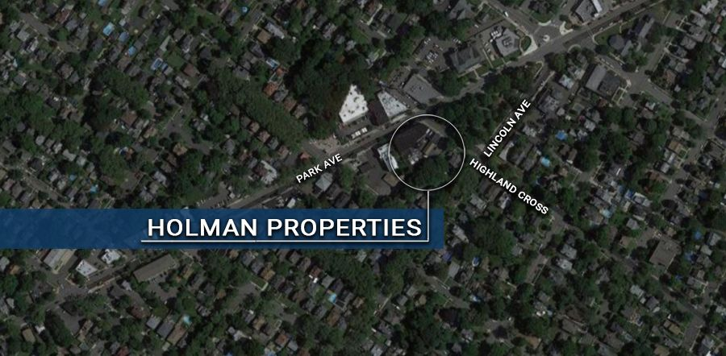

# Holman Properties (Block 110)

{: .img-fluid }

**Location:** Highland Cross, Park and Lincoln Avenues

**Project Description:** 

· A Designated Area in Need of Redevelopment

· The area straddles two zoning designations, a residential one-family (R-1) on Lincoln Avenue and a business three-story (B-3) on Park Avenue

**Below find documents related to Holman properties redevelopment:**

[Holman Mayor & Council Resolution No. 55-2021](https://storage.googleapis.com/static.rutherford-nj.com/community-development/holman/Holman%20M%26C%20RES%2055000.pdf)

[Block 110 Area In Need Of Redevelopment Study](https://storage.googleapis.com/static.rutherford-nj.com/community-development/holman/HOLMAN%20PROPERTY%20AREA%20IN%20NEED%20STUDY%20FINAL%20(00224202xD43F8).PDF)
