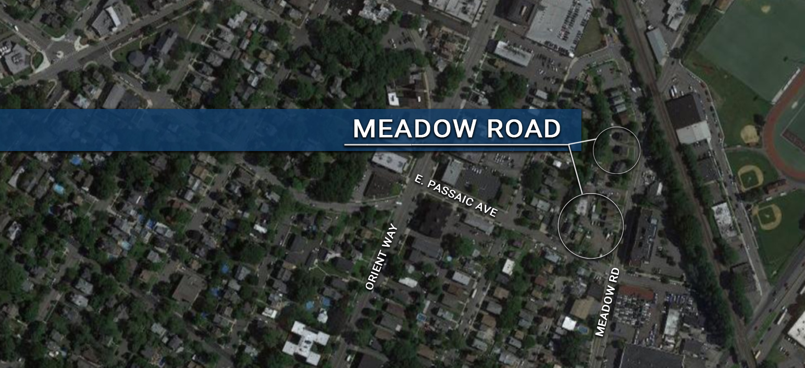

# Meadow Road

{: .img-fluid }

**Location:** Meadow Road

**Project Status:** Designated Area In Need Of Redevelopment

In the 2007 Master Plan, the Meadow Road corridor is identified as an area appropriate for redevelopment. More recently, the owner of  several of the properties abutting the road solicited a developer to purchase his properties. The developer subsequently requested the Borough conduct a redevelopment study. Not surprisingly, the area, which is dominated by a large underutilized parking area for landscaping and construction vehicles, does meet the criteria and was designated in January of 2018.  

**Below find Meadow Road Redevelopment Study & Preliminary Investigation Report:**

[Meadow Road Redevelopment Study and Preliminary Investigation Report](https://storage.googleapis.com/static.rutherford-nj.com/community-development/meadow-road/Meadow%20Road%20Area%20Redevelopment%20Study%20and%20Preliminary%20Investigation%20Report.pdf)
