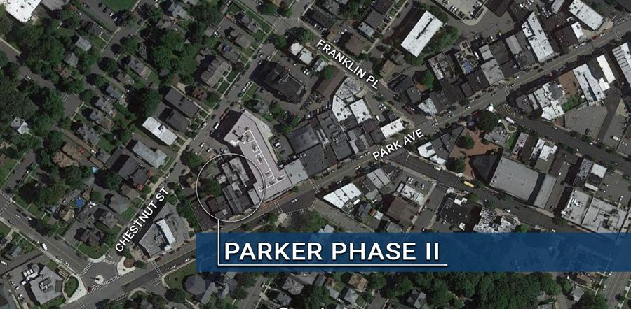

# 118 Park Ave

{: .img-fluid }

**Location:** 118 Park Ave

**Project Type:** Residential with retail space

**Project Status:** Completed

“The Parker 118”  is a 60 unit, residential building with 4 and 5 story sections and 2 first floor retail spaces.

The 92 parking spaces are enclosed within the structure, which also houses a drop-off lane for use by delivery services, it is accessed via Chestnut Street.

**Below find documents related to Parker Phase II redevelopment:**

[Mayor and Council Resolution No. 52-2021](https://storage.googleapis.com/static.rutherford-nj.com/community-development/parker-ii/Parker%20II%20M%26C%20RES%2052.pdf)

[Redevelopment Study](https://storage.googleapis.com/static.rutherford-nj.com/community-development/parker-ii/Area%20in%20Need%20of%20Redevelopment%20-%20Vango%202%20-%20March%2030%2C%202021%20(00254629xD43F8)%20(1).PDF)

[Parker Phase II Redevelopment Plan](https://storage.googleapis.com/static.rutherford-nj.com/community-development/parker-ii/Parker%20Phase%20II%20Redevelopment%20Plan.PDF)

[Redevelopment Agreement](https://storage.googleapis.com/static.rutherford-nj.com/community-development/parker-ii/11.3.2021%20Redevelopment%20Agreement.pdf)
