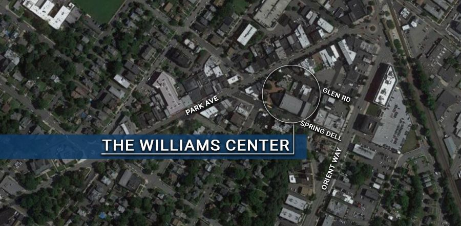

# Theatre District (Williams Center Area)

{: .img-fluid }

**Location:** 1 Williams Plaza

**Below find documents related to Williams Center redevelopment:**

[- Redevelopment Study (May, 2016)](https://storage.googleapis.com/static.rutherford-nj.com/community-development/williams-center/William%20Center_%20Theater%20District%20Redevelopment%20Study.pdf)

[- Redevelopment Plan (December, 2020)](https://storage.googleapis.com/static.rutherford-nj.com/community-development/williams-center/Wm%20Ctr%20M%26C%20RES201.pdf)

[- Redevelopment Plan (Amendment #1 – June, 2022)](https://storage.googleapis.com/static.rutherford-nj.com/community-development/williams-center/Redevelopment_Plan_Amendment_1.pdf)

[- Redevelopment Plan (Amendment #2 – July, 2023)](https://storage.googleapis.com/static.rutherford-nj.com/community-development/williams-center/Redevelopment_Plan_Amendment_2.pdf)

