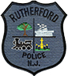
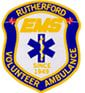

{: style="float: left; margin: 0 20px 20px 0;"}

[**Rutherford Police Department**](/departments/police/)

The RDP's priorities include the protection of life, liberty, and property to ensure all Borough residents and visitors experience a quality of life second to none.

---

{: style="float: left; margin: 0 20px 20px 0;"}

**Rutherford First-Aid Ambulance Corps** [www.rutherfordems.org](http://www.rutherfordems.org/)

The Rutherford First-Aid Ambulance Corps is a volunteer, non-profit organization dedicated to providing Emergency Medical Services to our residents.

---

{: style="float: left; margin: 0 20px 20px 0;"}

[**Rutherford Volunteer Fire Department**](/departments/fire-department/)

Protecting over 18,000 residents within an area of 2.4 square miles and consists of five fire companies and operate out of three firehouses strategically located throughout the Borough:  

